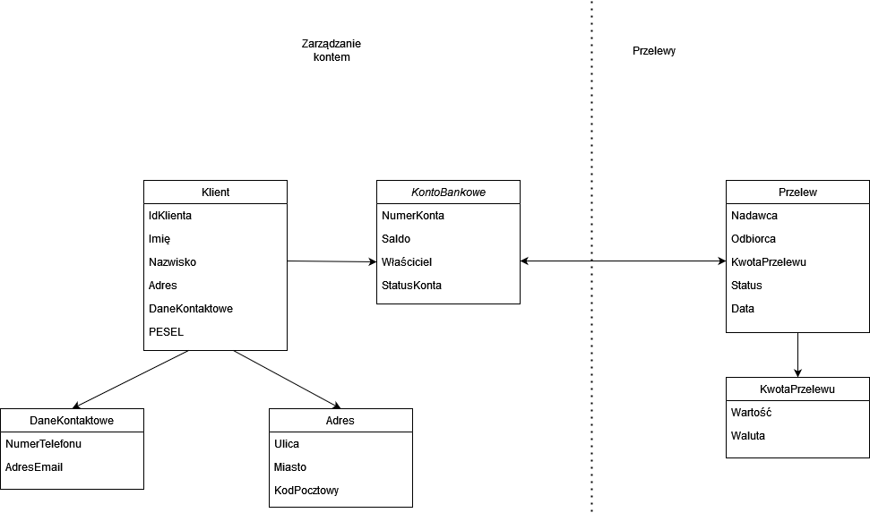

### 1. Opis zadania

Celem zadania jest zaprojektowanie fragmentu bezpiecznej aplikacji bankowej w oparciu o zasady **Domain Driven Design (DDD)**, koncentrując się na wybranym wycinku systemu. Zdefiniowałam dwa konteksty Przelewy oraz KontoBankowe, operacje dostępne w ramach kontekstów i między kontekstami, agregaty, encje oraz obiekty wartości.

---

### 2. Definiowanie Bounded Context

W wybranym fragmencie systemu bankowego można wyróżnić następujące konteksty:

- **Kontekst Zarządzania Kontem** - odpowiada za tworzenie, aktualizację i usuwanie kont bankowych oraz zarządzanie ich atrybutami.
- **Kontekst Przelewów** - odpowiada za autoryzację i realizację przelewów.

---

### 3. Modelowanie Agregatów, Encji i Obiektów Wartości

#### Agregaty:

- **KontoBankowe**
  - Odpowiada za informacje o koncie bankowym oraz jego właścicielu. 
  - Kluczowe operacje to: otwarcie konta, zamknięcie konta, pobranie salda, sprawdzenie statusu konta.

- **Przelew**
  - Przechowuje dane o transakcjach, w tym o ich kwocie, odbiorcy, dacie i statusie realizacji.
  - Kluczowe operacje to: inicjalizacja przelewu, zatwierdzenie przelewu, anulowanie przelewu.

#### Encje:

- **KontoBankowe**
  - Korzeń agregatu KontoBankowe. Odpowiada za informacje o koncie bankowym oraz jego właścicielu. 

- **Przelew**
  - Korzeń agregatu Przelew. Przechowuje dane o transakcjach, w tym o ich kwocie, odbiorcy, dacie i statusie realizacji. 
  
- **Klient**
  - Odpowiada za podstawowe dane klienta, takie jak imię, nazwisko, identyfikator klienta.

#### Obiekty Wartości:

- **Adres**
  - Zawiera szczegóły dotyczące adresu klienta, takie jak ulica, miasto, kod pocztowy.

- **KwotaPrzelewu**
  - Reprezentuje kwotę przelewu oraz jej walutę, wraz z weryfikacją poprawności kwoty.

 **DaneKontaktowe**
  - Zawiera szczegóły dotyczące sposobów kontaktu z klientem - jego adres email oraz numer telefonu.

---

### 4. Przyjęte założenia

Poniżej znajduje się szczegółowa tabela zawierająca formaty danych oraz ograniczenia dla poszczególnych atrybutów encji i obiektów wartości. 

| Encja / Obiekt Wartości | Atrybut          | Typ danych                | Format / Ograniczenia                                                                      |
|------------------------|------------------|---------------------------|--------------------------------------------------------------------------------------------|
| **KontoBankowe**       | `numerKonta`     | String                    | 26-cyfrowy numer (np. format IBAN dla Polski: 26 cyfr); niepowtarzalny, wymagany.          |
|                        | `saldo`          | Decimal                   | Wartość dziesiętna >= 0; precyzja do dwóch miejsc po przecinku; np. `Decimal(18,2)`.       |
|                        | `właściciel`     | `Klient` (Obiekt)         | Wymagane powiązanie z obiektem typu `Klient` poprzez pole `idKlienta`.                     |
|                        | `statusKonta`    | Enum                      | Wartości: `AKTYWNE`, `ZABLOKOWANE`, `ZAMKNIĘTE`; domyślnie `AKTYWNE`.                      |
| **Przelew**            | `kwota`          | `KwotaPrzelewu` (Obiekt)  | Powiązany obiekt wartości                                                                  |
|                        | `data`           | DateTime                  | Format ISO 8601, np. `YYYY-MM-DDTHH:MM:SS`; musi być datą bieżącą lub przyszłą.            |
|                        | `odbiorca`       | String                    | Numer konta odbiorcy, ograniczenia tj. w polu `numerKonta`.                                |
|                        | `status`         | Enum                      | Wartości: `INICJOWANY`, `ZATWIERDZONY`, `ANULOWANY`; domyślnie `INICJOWANY`.               |
| **Klient**             | `idKlienta`      | UUID                      | Unikalny identyfikator w formacie UUID, generowany automatycznie.                          |
|                        | `imię`           | String                    | Maksymalnie 50 znaków; wymagane; tylko litery.                                             |
|                        | `nazwisko`       | String                    | Maksymalnie 50 znaków; wymagane; tylko litery oraz myślnik.                                |
|                        | `adres`          | `Adres` (Obiekt)          | Wymagane powiązanie z obiektem typu `Adres`.                                               |
|                        | `daneKontaktowe` | `DaneKontaktowe` (Obiekt) | Powiązany obiekt wartości                                                                  |
|                        | `PESEL`          | `String`                  | Ciąg 11 cyfr, zaimplementowane sprawdzenie liczby kontrolnej numeru.                       |
| **Adres**              | `ulica`          | String                    | Maksymalnie 100 znaków, wymagane.                                                          |
|                        | `miasto`         | String                    | Maksymalnie 50 znaków, wymagane; tylko litery.                                             |
|                        | `kodPocztowy`    | String                    | Wymagany format zgodny z polskim kodem pocztowym: `XX-XXX` (np. 00-950).                   |
| **KwotaPrzelewu**      | `wartość`        | Decimal                   | Wartość dziesiętna > 0; precyzja do dwóch miejsc po przecinku; np. `Decimal(18,2)`.        |
|                        | `waluta`         | String                    | Trzyznakowy kod waluty zgodny z ISO 4217, np. `PLN`, `USD`, `EUR`; domyślnie `PLN`.        |
| **DaneKontaktowe**     | `numerTelefonu`  | String                    | Dziewięć cyfr wraz z numerem kierunkowym.                                                  |
|                        | `adresEmail`     | String                    | Ciąg znaków (cyfry, litery, wybrane znaki specjalne tj. `.`, `_`, `-`, `@`)                |

#### Operacje w interakcji między kontekstami

- **Zarządzanie Kontem** i **Przelewy**: KontoBankowe może inicjować i zatwierdzać przelewy na podstawie dostępnych środków, jeśli konto nie jest zamknięte ani zablokowane. Realizacja przelewów przekłada się na saldo konta nadawcy oraz konta odbiorcy.
---

### 5. Diagram modelu

Diagram modelu przedstawia wszystkie wymienione encje oraz obiekty wartości. Zdefiniowane są dwa konteksty: zarządzanie kontem oraz przelewy. Zaznaczona została granica między kontekstami. 

---

